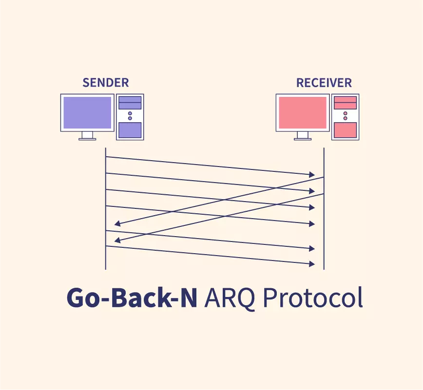

# 🌐 Network Transmission Protocol Simulation

## 🚀 Go-Back-N Protocol Transmission Simulator

---

### 📋 Overview
This Python script simulates a network transmission protocol using the Go-Back-N technique, demonstrating frame transmission, error handling, and wire efficiency calculation.

---

### 📊 Diagram



---

### ✨ Features
- Simulates network frame transmission with potential frame failures
- Implements Go-Back-N protocol
- Calculates wire efficiency
- Provides detailed transmission statistics
- Converts messages to binary representation
- Handles dynamic window sizes

---

### 🛠️ Installation

#### Prerequisites
- Python 3.8+
- `random` module (standard library)

#### Clone Repository
```sh
git clone https://github.com/Spafic/Go_Back_N_Protocol.git
cd Go_Back_N_Protocol
```

#### Install Dependencies
No additional dependencies are required as the script uses Python's standard library.

#### Run the Simulator
```sh
python main.py
```

#### User Inputs
1. Message to transmit
2. Window size for transmission

> [!NOTE]
> **Example Workflow**
> 
> ```sh
> Enter message: Hello
> Enter window size: 3
> ```

---

### ⚙️ Protocol Mechanics
- Dynamically sends frames based on window size
- Randomly simulates frame transmission success/failure
- Supports automatic retransmission of failed frames using Go-Back-N strategy
- Tracks and reports transmission efficiency

---

### 📈 Output Details
- Received message
- Binary representation
- Total frames sent
- Failed frames
- Wire efficiency percentage

---

### 🧩 Simulation Characteristics
- Random frame transmission success
- Go-Back-N frame management
- Adaptive retransmission strategy

---

### 🤝 Contributing

We welcome contributions to enhance the Go-Back-N Protocol Transmission Simulator. To contribute, follow these steps:

1. **Fork the Repository**: Click the "Fork" button at the top right of the repository page to create a copy of the repository in your GitHub account.
2. **Clone Your Fork**: Clone your forked repository to your local machine.
    ```sh
    git clone https://github.com/YourUsername/Go_Back_N_Protocol.git
    cd Go_Back_N_Protocol
    ```
3. **Create a Feature Branch**: Create a new branch for your feature or bug fix.
    ```sh
    git checkout -b feature/YourFeatureName
    ```
4. **Make Changes**: Implement your feature or bug fix.
5. **Commit Your Changes**: Commit your changes with a descriptive commit message.
    ```sh
    git commit -m 'Add YourFeatureName'
    ```
6. **Push to Your Branch**: Push your changes to your forked repository.
    ```sh
    git push origin feature/YourFeatureName
    ```
7. **Open a Pull Request**: Go to the original repository and open a pull request to merge your changes.

Thank you for your contributions!

---

### 💡 Inspiration
This project demonstrates fundamental concepts in network transmission protocols, specifically the Go-Back-N technique used in data communication.

---

### 📜 License
This project is licensed under the MIT License. See the [MIT LICENSE](./LICENSE) file for more details.
